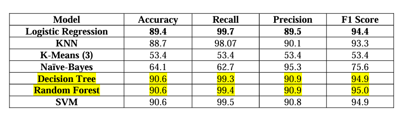

<h1>End - End Project</h1>
<h2>Problem Statement</h2>

Considering the intensifying threat of terrorist attacks, the indispensable requirement for 
analysing, understanding and interpreting the multi-dimensional obstacles inflicted by the terrorist 
activities.  This problem statement aims to interpret key trends and analytics of the attacks’ 
aftermaths and then conclude on important observations which are based on few data-driven 
insights that help in mitigating the impact of these terrorist attacks and prevent future incidents at 
global scale. The ultimate goal is understand the repeated hidden trends that have taken place in 
the past over the years 1970 to 2017 and then make some advanced predictions with observed 
observations.

<h3>Dataset</h3>
<a href="https://www.kaggle.com/datasets/START-UMD/gtd">Dataset Link</a>
 
<h2>Phase 1 Analysis of Data</h2>
<h3>Preprocessing</h3>

The process of locating and fixing or removing errors and inconsistencies from datasets is 
known as data cleaning, sometimes known as data cleansing or data preparation. It entails getting 
the data ready for analysis by making sure it is correct, comprehensive, and formatted correctly. 
Data cleaning encompasses a variety of tasks, including:

<ul>
    <li>Data Investigation</li>
    <li>Features Selection</li>
    <li>Handling Missing Data</li>
    <li>Handling Duplicate Values</li>
    <li>Handling Null Values</li>
    <li>Handling Non-Positive Values</li>
    <li>Column Integration</li>
    <li>Handling Inconsistent Data</li>
    <li>Renaming Columns</li>
    <li>Sorting Columns and Reset Index</li>
</ul>
<h3>EDA</h3>
<ul>
    <li>1. Univariant Analysis</li>
    <li>2. Bivariate Analysis</li>
    <li>3. Visualizing Attack Types Using Pie Chart</li>
    <li>4. Visualizing Number of Killed and Wounded Per Year</li>
    <li>5. Causality Display using Bar Graph</li>
    <li>6. Crosstab Between Target Type and Weapon Type</li>
    <li>7. Crosstab Analysis Between Attack Type and Weapon Type</li>
    <li>8. Analyzing Attacks Year Wise</li>
    <li>9. Visualizing Top 5 Countries and Cities</li>
    <li>10. Examining Success Rate Year Wise</li>
</ul>

<h2>Phase 2 Implementing Known ML Algorithms using SKlearn </h2>

Implemented 7 Algorithms namely:

<ol>
    <li>Logistic Regression</li>
    <li>SVM Classifier</li>
    <li>K-means</li>
    <li>K-NN</li>
    <li>Random Forest</li>
    <li>Decision Tree</li>
    <li>Naive-Bayes Classifier </li>
</ol>
<h3>Conclusion</h3>

To conclude we have chosen 7 algorithms in total where 4 from the lectures and 3 out of 
the lectures to explore the working of the algorithms. Out of all, decision tree classifier is our 
best model for the problem statement which is explained in detail by the visualization of how its 
classifies each class. This helps us the decisions makers in the real world to explore the impact of 
each feature on the attack and thereby take necessary actions to mitigate similar attacks in the 
future. Next best is the Random Forest algorithm which provides the same accuracy of the 
decision tree. But considering other metrics, the performance decision tree is considered best for 
classifying whether an attack is successful or not. 

